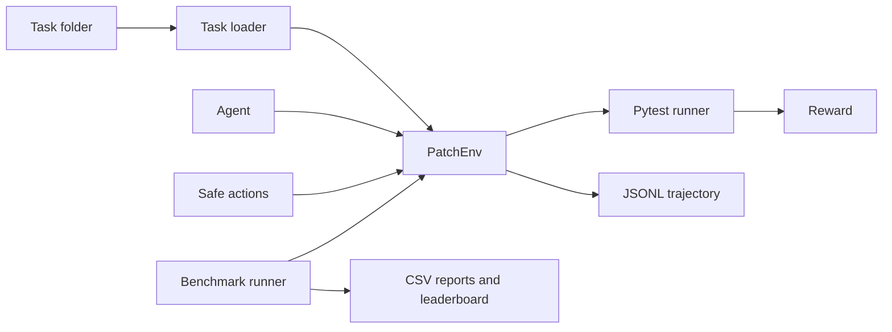

# PatchGym


PatchGym is a lightweight local environment for evaluating code-repair agents.
Each task contains a small buggy Python program, pytest tests, metadata, and a
short description. Agents choose from predefined safe patch actions, PatchGym
runs the tests, calculates reward, and writes JSONL trajectories for inspection.

The project is intentionally CPU-friendly and small enough to run on a laptop.

## Features

- 15 local Python code-repair tasks
- Safe predefined action registry
- Gym-style `PatchEnv.reset()` and `PatchEnv.step()` API
- pytest-based verification in temporary workspaces
- Simple reward shaping
- JSONL trajectory logging
- RandomAgent, HeuristicAgent, and QLearningAgent baselines
- Benchmark runner with CSV reports
- CSV leaderboard generation
- Task validation command
- GitHub Actions CI

## Quickstart

```powershell
python -m venv .venv
.venv\Scripts\Activate.ps1
pip install -e ".[dev]"
pytest
```

Validate tasks:

```powershell
patchgym validate-tasks --tasks tasks
```

Run one task:

```powershell
patchgym run-task --task tasks/task_003_wrong_operator --agent heuristic
```

Run a benchmark:

```powershell
patchgym benchmark --agent heuristic --tasks tasks --episodes 1
```

## Basic Usage

```python
from patchgym.agents import HeuristicAgent
from patchgym.env import PatchEnv

with PatchEnv("tasks/task_003_wrong_operator", agent_name="HeuristicAgent") as env:
    obs, info = env.reset()
    agent = HeuristicAgent(env.action_space, bug_type=env.task.bug_type)

    done = False
    truncated = False
    while not done and not truncated:
        obs, reward, done, truncated, info = env.step(agent.act(obs))

print(obs, reward, done, truncated)
```

## Architecture



Important modules:

- `patchgym.actions`: safe code transformations
- `patchgym.env`: environment, observations, and reward calculation
- `patchgym.runners`: pytest runner and benchmark runner
- `patchgym.agents`: random, heuristic, and tabular Q-learning baselines
- `patchgym.trajectories`: JSONL logging
- `patchgym.reporting`: benchmark CSV and leaderboard helpers
- `patchgym.tasks`: task loading and validation

## Task Format

Each task folder has four files:

```text
tasks/task_001_off_by_one/
  buggy.py
  tests.py
  metadata.json
  README.md
```

`metadata.json` declares the task ID, bug type, maximum steps, expected fix,
allowed action IDs, and tags. The validator checks that metadata is well-formed
and that allowed actions exist in the registry.

## Current Tasks

| Task | Bug Type |
| --- | --- |
| `task_001_off_by_one` | Off-by-one loop |
| `task_002_none_guard` | Missing None guard |
| `task_003_wrong_operator` | Wrong comparison operator |
| `task_004_empty_list_guard` | Missing empty-list guard |
| `task_005_less_equal_boundary` | Wrong comparison boundary |
| `task_006_not_equal_operator` | Wrong equality operator |
| `task_007_greater_equal_boundary` | Wrong comparison boundary |
| `task_008_less_than_discount` | Wrong comparison boundary |
| `task_009_none_title_guard` | Missing None guard |
| `task_010_sum_off_by_one` | Off-by-one loop |
| `task_011_binary_search_boundary` | Binary search boundary |
| `task_012_normalize_slug_none` | Missing None guard |
| `task_013_dedupe_preserve_order` | Membership operator |
| `task_014_valid_name_logic` | Boolean logic |
| `task_015_public_default` | Boolean literal |

## Reward Design

Rewards are deliberately simple:

- `+10.0` when all tests pass
- `+2.0` per additional passing test
- `-0.5` when the pass count does not improve
- `-2.0` for syntax errors
- `-3.0` for timeouts
- `-0.1` step cost

Passing all tests dominates the reward, while partial progress is still visible.

## Agents

`RandomAgent` chooses randomly from the task action space.

`HeuristicAgent` uses task metadata and the last error type to prefer relevant
actions. For example, off-by-one tasks prefer range and boundary actions, while
None-related tasks prefer `add_none_guard`.

`QLearningAgent` is a small tabular Q-learning baseline. Its state includes the
bug type, number of passing tests, last error type, and step count. It is kept
simple on purpose, but it gives the project a real learning-agent baseline.

`HeuristicAgent` is a metadata-aware upper-bound baseline, not a realistic
autonomous repair agent.

## Benchmark Reports

Benchmarks write two CSV files under `outputs/reports/`:

- `benchmark_<agent>_<timestamp>.csv`: one row per task episode
- `leaderboard_<agent>_<timestamp>.csv`: aggregate solve rate, average steps,
  average reward, syntax errors, and timeouts

Trajectories are written under `outputs/trajectories/` unless disabled with
`--no-trajectories`.

Example leaderboard from the heuristic baseline:

| Agent | Runs | Solved | Solve Rate | Avg Steps |
| --- | ---: | ---: | ---: | ---: |
| HeuristicAgent | 15 | 15 | 1.0 | 1.0 |

## Trajectory Example

```json
{"action_id":"replace_greater_than_with_greater_equal","agent":"HeuristicAgent","changed":true,"code_hash_after":"...","code_hash_before":"...","done":true,"duration_ms":391,"episode_id":"...","error_type":null,"reward":11.9,"step":1,"task_id":"task_003_wrong_operator","tests_failed":0,"tests_passed":3,"truncated":false}
```

## CI

GitHub Actions installs the package, runs `ruff check .`, executes pytest,
validates all tasks, and runs a heuristic benchmark smoke test.

## Why This Matters

PatchGym keeps the coding-agent evaluation loop small and inspectable:
patch action, test feedback, reward, and trajectory record. That makes it useful
for experimenting with repair policies before moving to larger benchmark suites.

## Security Note

PatchGym executes local Python tasks through pytest. It is designed for trusted
local benchmark tasks only. It is not a secure sandbox for untrusted code. Future
versions may add Docker-based isolation.

## Limitations

PatchGym v0.1 uses simple regex/text transformations. This keeps the environment
lightweight and explainable, but it is not a full semantic code-repair engine.
Future versions will add token-aware or AST-aware transformations.

## Roadmap

- Add Docker-based task isolation
- Add token-aware or AST-aware actions
- Add richer trajectory parsing and reporting
- Add optional dashboard for benchmark inspection
- Add hidden-test support for more realistic evaluation

## License

MIT license.
